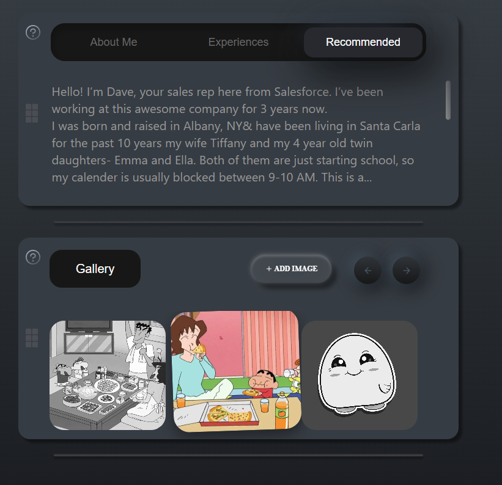
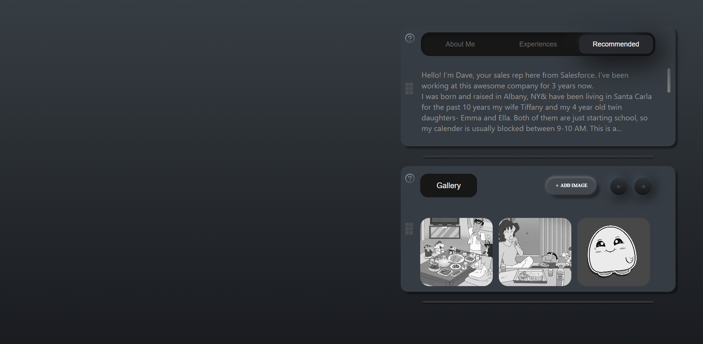

# 🎨 Gallery Widget

A modern and interactive **Gallery Widget** built using React and Tailwind CSS.  
This project replicates the design provided in Figma, maintaining pixel-perfect alignment and responsiveness for laptop screens (width ≥ 769px).

---

## 🚀 Live Demo
🔗 **[View Deployed Project](https://gallery-widget-hcfe.vercel.app/)**

---

## 🖼️ Screenshots

### Image 1


### Image 2


---

## 🧩 Features

- Fully responsive layout for laptop screens (above 769px width)
- Clean and modern UI following Figma specifications
- Interactive tab and gallery components
- Gradient backgrounds and hover overlays
- Well-structured, modular React components

---

## 🛠️ Tech Stack

- **React.js** – Frontend library  
- **Vite** – Build tool for fast development  
- **Tailwind CSS** – Styling framework  
- **Vercel** – Deployment platform  

---

## 📁 Folder Structure
src/
├── components/
│ ├── TabWidget.jsx
│ ├── GalleryWidget.jsx
├── pages/
│ ├── Home.jsx
├── images/
│ ├── image1.png
│ ├── image2.png
│ ├── Rectangle.png
└── App.jsx    


---

## ⚙️ Installation & Setup

To run this project locally:

```bash
# Clone this repository
git clone https://github.com/<your-username>/GalleryWidget.git

# Navigate to project folder
cd GalleryWidget

# Install dependencies
npm install

# Start the development server
npm run dev

